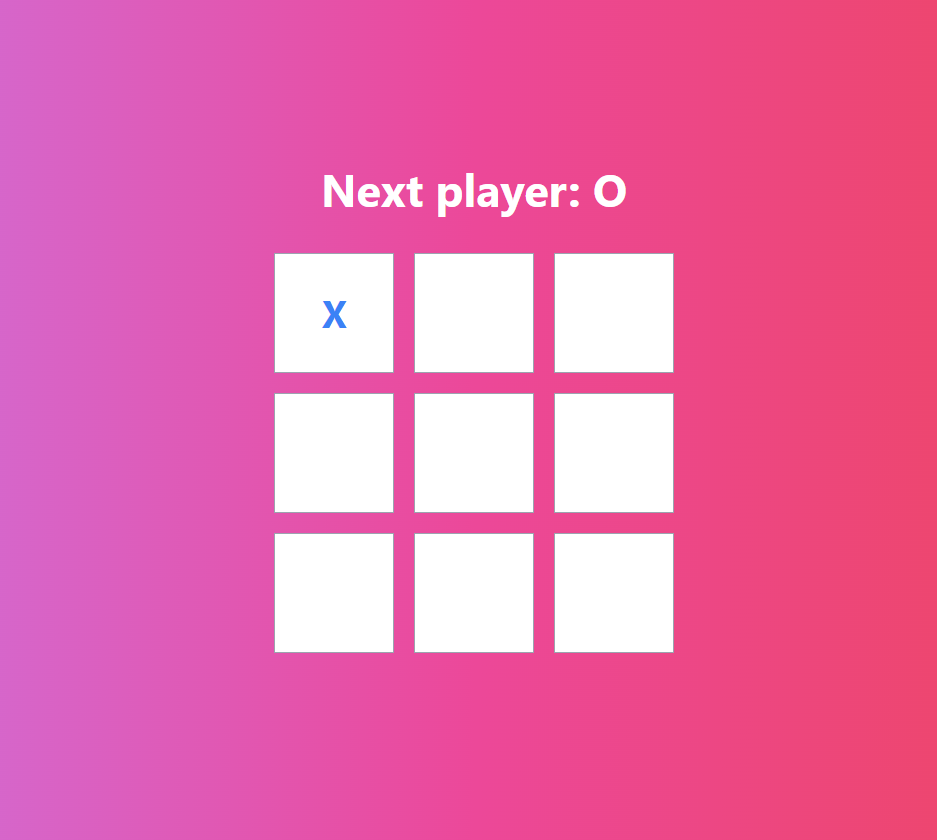
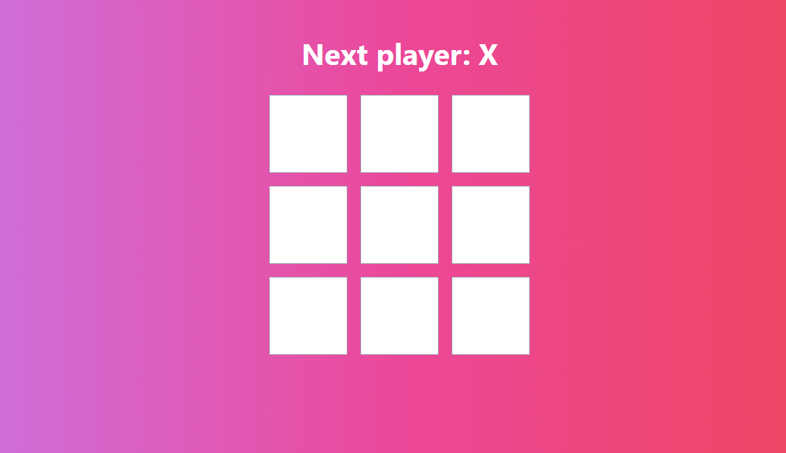
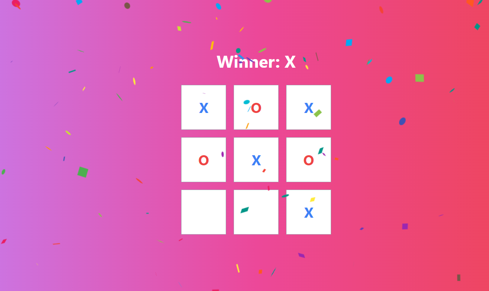

# Tic Tac Toe Game

This is a classic Tic Tac Toe game implemented using React.js. It allows two players to take turns marking Xs and Os on a 3x3 grid. The game declares a winner or a draw when appropriate.

## Features

- Two players (X and O) take turns marking squares on the grid.
- The game announces the winner when three of the same symbols (X or O) appear in a row, column, or diagonal.
- If all squares are filled without any winning combinations, the game declares a draw.
- The UI is responsive and user-friendly.
- A celebration effect with visual confetti and audible crackers is displayed when a winner is declared.

## Technologies Used

- React.js
- Tailwind CSS
- react-confetti library for visual effects
- Web Audio API for sound effects

## Getting Started
Frontend:  https://tic-tac-toe-chi-henna.vercel.app/
1. Clone the repository:
   
bash
git clone https://github.com/Renuka19990/Tic-tac-toe

Snapshot of Website

## Application Snapshots

